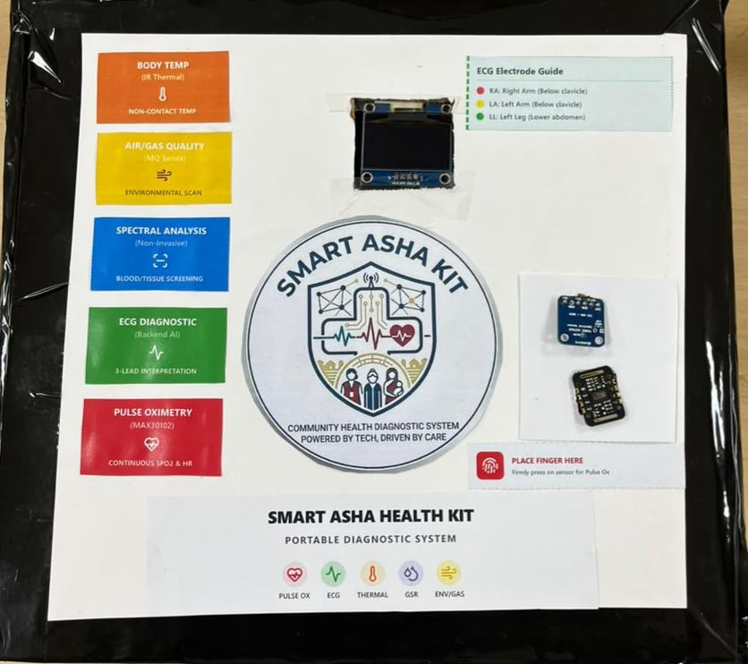
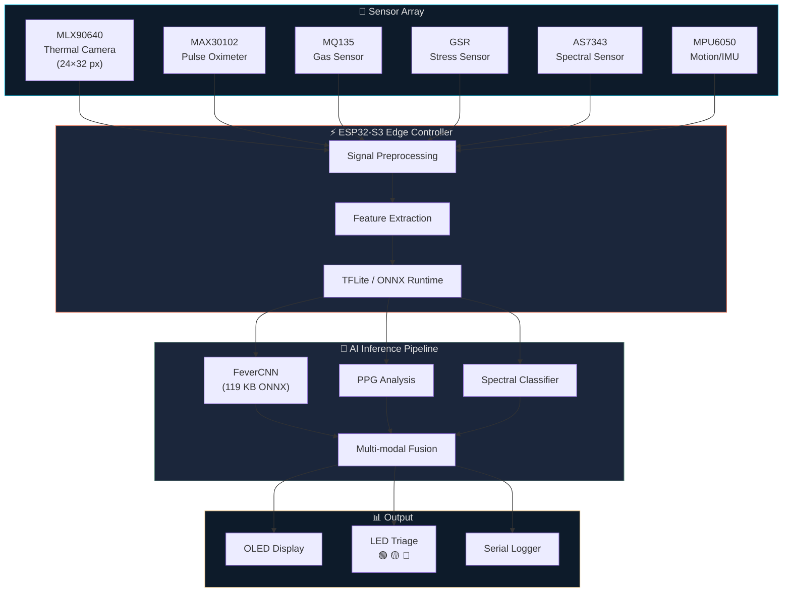
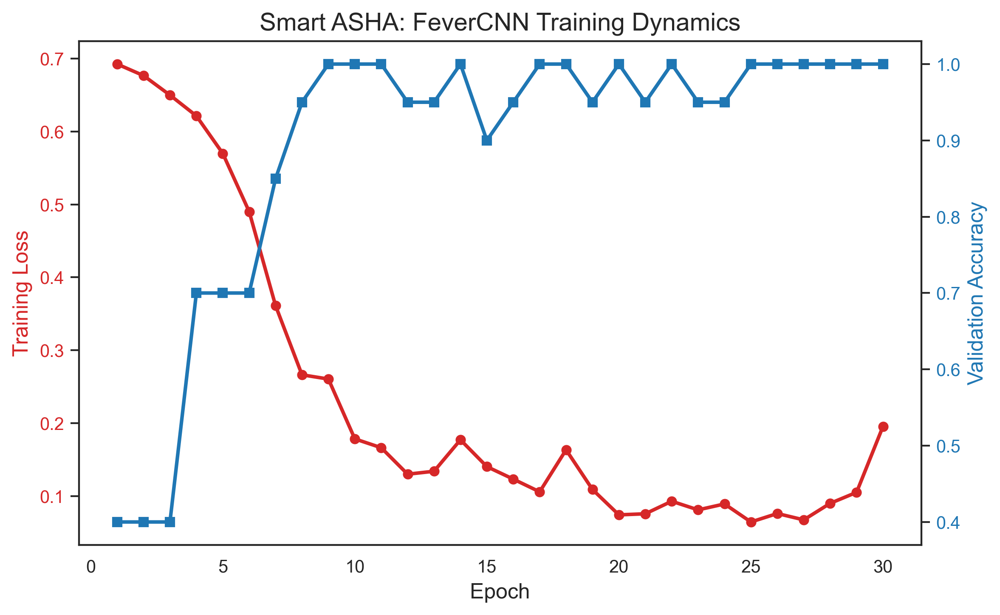
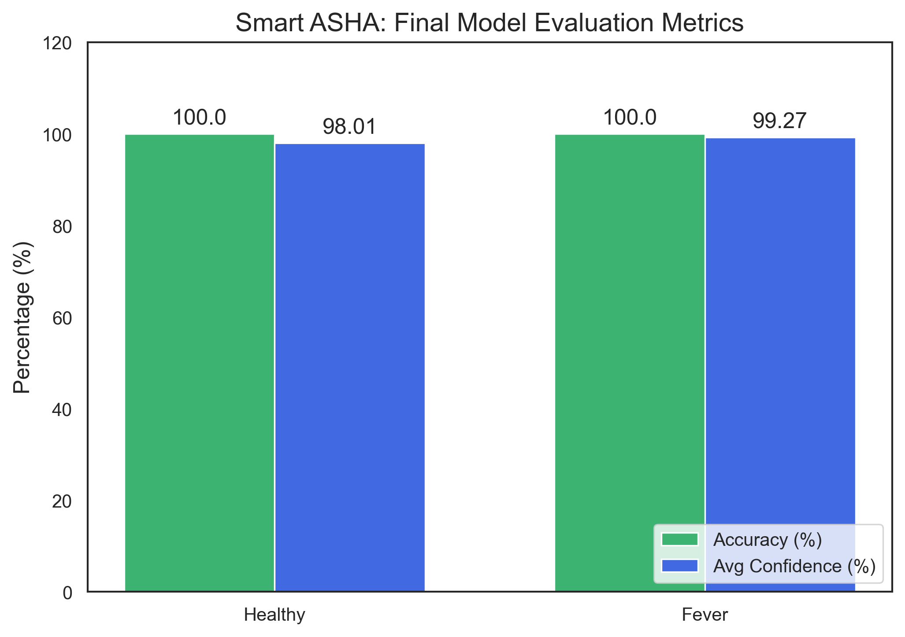
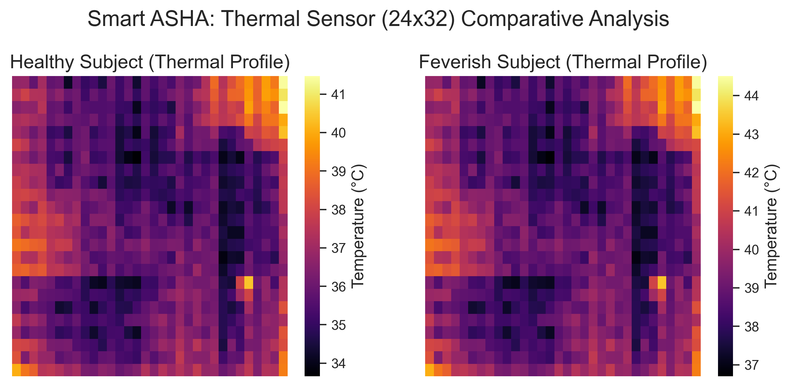
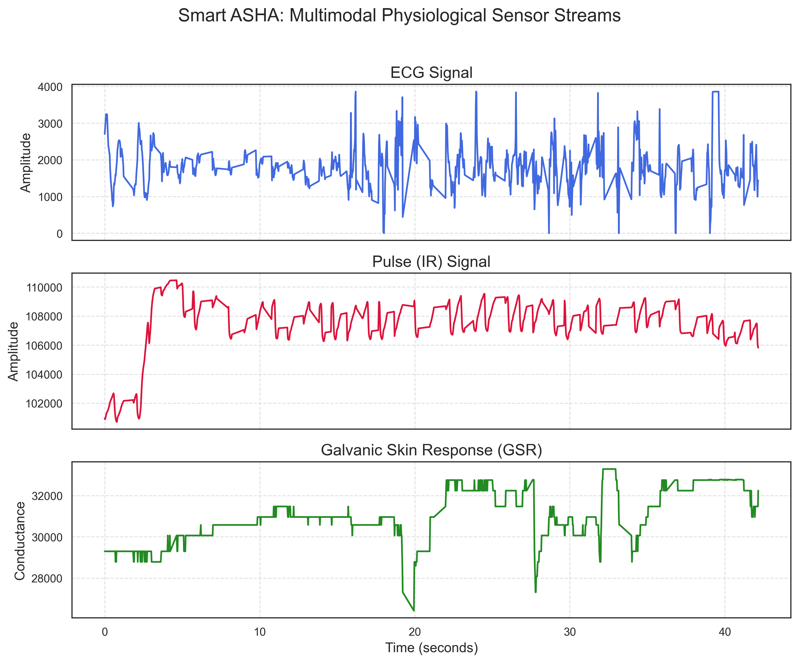

<p align="center">
  
</p>

<h1 align="center">Arogya AI</h1>

<p align="center">
  <strong>Portable Edge-AI Healthcare Triage System for Rural Health Workers</strong>
</p>

<p align="center">
  
  
  
  
  
  
  
</p>

<p align="center">
  <em>AI-powered, offline-capable health screening for India's 1M+ ASHA workers — no internet required.</em>
</p>

<p align="center">
  
  <br/>
  <em>Arogya AI Portable Edge-AI Device Prototype</em>
</p>

---

## 🌍 The Problem

> **900 million** people in rural India depend on **ASHA workers** as their first point of healthcare contact. These workers currently rely on manual observations, lack diagnostic tools, and face delayed referrals — costing critical time for high-risk patients in areas with **zero internet connectivity**.

## 💡 Our Solution

**Arogya AI** is a portable, battery-powered device that uses **Edge AI** and **multimodal sensors** to perform real-time health screening **entirely on-device**. It detects fever, monitors blood oxygen, assesses respiratory conditions, estimates stress levels, and screens for metabolic abnormalities — all without requiring an internet connection.

---

## ✨ Key Features

| Feature | Sensor | AI Model |
|:--------|:-------|:---------|
| 🌡️ **Fever Detection** | MLX90640 Thermal Camera | FeverCNN (PyTorch → ONNX) |
| 💓 **SpO₂ & Heart Rate** | MAX30102 Pulse Oximeter | Signal Processing + PPG |
| 🫁 **Respiratory Assessment** | MQ135 Gas Sensor | Breath Pattern Analysis |
| 😰 **Stress Estimation** | GSR Sensor | Galvanic Skin Response ML |
| 🔬 **Anemia Screening** | Spectral Sensor (AS7343) | Hemoglobin Absorption Model |
| 📊 **Real-time Triage** | All sensors combined | Multi-modal Fusion Pipeline |

---

## 🏗️ System Architecture



---

## 🧠 Model Performance

### Fever Detection — FeverCNN

| Metric | Value |
|:-------|:------|
| **Architecture** | 2× Conv2D (ReLU, MaxPool) → 2× Dense |
| **Input** | 1 × 24 × 32 (Grayscale Thermal) |
| **Model Size** | ~119 KB (ONNX) |
| **Healthy Accuracy** | **100%** (Avg. Confidence: 98.01%) |
| **Fever Accuracy** | **100%** (Avg. Confidence: 99.27%) |
| **Target Hardware** | ESP32-S3 / Arduino Nano 33 BLE |

<details>
<summary>📈 <strong>Training & Evaluation Visualizations</strong></summary>

| Training Curves | Model Metrics |
|:---:|:---:|
|  |  |

| Thermal Comparison | Multimodal Streams |
|:---:|:---:|
|  |  |

</details>

---

## 🔧 Hardware Components

| Component | Model | Purpose |
|:----------|:------|:--------|
| 🎛️ MCU | **ESP32-S3** | Edge AI controller with dual-core 240 MHz |
| 🌡️ Thermal | **MLX90640** | 24×32 IR thermal camera (fever detection) |
| 💓 Pulse Ox | **MAX30102** | SpO₂ and heart rate via PPG |
| 🏃 IMU | **MPU6050** | 6-axis accelerometer + gyroscope |
| 😰 GSR | **Grove GSR** | Galvanic skin response (stress) |
| 💨 Gas | **MQ135** | Air quality / breath analysis |
| 🔬 Spectral | **AS7343** | 11-channel spectral sensor (anemia) |
| 🖥️ Display | **SSD1306 OLED** | 128×64 status display |
| 💡 LEDs | **RGB LEDs** | Triage indicators (Green/Yellow/Red) |
| 🔋 Power | **Li-Po 3.7V** | Rechargeable battery system |

---

## 📁 Repository Structure

```
Arogya AI/
│
├── 📄 README.md                    ← You are here
├── 📄 LICENSE                      ← MIT License
├── 📄 .gitignore                   ← Python/C++/Arduino ignores
├── 📄 .gitattributes               ← Git LFS tracking
├── 📄 CONTRIBUTING.md              ← How to contribute
├── 📄 CHANGELOG.md                 ← Version history
├── 📄 requirements.txt             ← Python dependencies
│
├── 📂 data/                        ← Raw sensor data (CSV, NPY)
├── 📂 datasets/                    ← Curated ML-ready datasets
├── 📂 models/                      ← Trained weights (.pth, .onnx)
├── 📂 scripts/                     ← Training & data pipelines
├── 📂 utils/                       ← Shared config, models, helpers
├── 📂 tests/                       ← Verification & test scripts
│
├── 📂 edge-impulse/                ← Edge Impulse C++ inference libs
│   ├── Arogya AI_Inference/       ← v1.0 inference library
│   └── Arogya AI_2.0_inferencing/ ← v2.0 inference library
│
├── 📂 firmware/                    ← ESP32 firmware & flashing
├── 📂 hardware/                    ← Schematics, BOM, wiring
├── 📂 libs/                        ← Packaged libraries & drivers
├── 📂 docs/                        ← Reports, presentations, visuals
└── 📂 images/                      ← README & documentation assets
```

> 📖 **Each directory contains its own `README.md`** with detailed documentation.

---

## 🚀 Quick Start

### Prerequisites

- Python 3.8+
- Arduino IDE 2.0+ (for firmware)
- [Edge Impulse CLI](https://docs.edgeimpulse.com/docs/tools/edge-impulse-cli) (optional)

### 1. Clone the Repository

```bash
git clone https://github.com/anmoln-27/Arogya AI.git
cd Arogya AI
```

### 2. Install Python Dependencies

```bash
pip install -r requirements.txt
```

### 3. Train the Fever Detection Model

```bash
python scripts/train_fever_model.py
```

### 4. Export to ONNX for Edge Deployment

```bash
python scripts/export_fever_to_onnx.py
```

### 5. Run Model Verification

```bash
python tests/verify_test_samples.py
```

### 6. Collect Sensor Data (with ESP32 connected)

```bash
python utils/asha_logger.py
```

---

## 🔬 Sensor Data Pipeline


---

## 📊 Datasets Overview

| Dataset | Type | Purpose | Size |
|:--------|:-----|:--------|:-----|
| `SmartASHA_Dataset` | Thermal (24×32) | Fever/Healthy classification | ~2,500 samples |
| `SmartASHA_Test_Images` | Thermal PNG | Visual verification | ~100 images |
| `SmartASHA_Test_Samples` | Thermal NPY | Automated testing | ~50 samples |
| `Arogya AI_Multimodal_Dataset` | CSV | ECG, GSR, Gas, PPG, Temp | ~5,000 rows |
| `Arogya AI_EdgeImpulse` | Formatted CSV | Edge Impulse BYOM format | Derived |

---

## 🤝 Contributing

We welcome contributions! Please see our [Contributing Guide](CONTRIBUTING.md) for details on:

- 🍴 Fork & branch workflow
- 📝 Code style guidelines
- 🧪 Testing requirements
- 📬 Pull request process

---

## 👥 Team

| Name | Role | GitHub |
|:-----|:-----|:-------|
| **Anmol** | Project Lead & Systems Architect | [@anmoln-27](https://github.com/anmoln-27) |
| **Vansh** | AI/ML Engineer & Edge Deployment | [@vansh7nvc](https://github.com/vansh7nvc) |
| **Gauri** | Research Lead & Data Science |  [@guptagauri04](https://github.com/guptagauri04)|

---

## 📜 License

This project is licensed under the **MIT License** — see the [LICENSE](LICENSE) file for details.

---

## 🌟 Acknowledgments

- [Edge Impulse](https://edgeimpulse.com/) — TinyML platform for on-device model deployment
- [PyTorch](https://pytorch.org/) — Deep learning framework for model training
- [ONNX](https://onnx.ai/) — Open standard for ML model interoperability
- [Espressif](https://www.espressif.com/) — ESP32-S3 hardware platform
- India's **ASHA Workers** — The real heroes of rural healthcare 🇮🇳

---

<p align="center">
  <strong>Built with ❤️ for rural healthcare</strong><br/>
  <em>Making AI-powered diagnostics accessible to the last mile</em>
</p>
