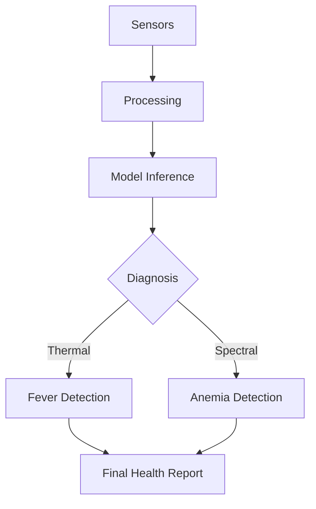

# 📋 Arogya AI: Project Technical Report
**Date:** April 22, 2026
**Status:** Reorganized & Verified
**Target:** Edge Deployment (ESP32/MCU)

---

## 1. Project Overview
Arogya AI is a multimodal health diagnostic assistant designed for frontline health workers (ASHAs). It leverages non-invasive sensors—Thermal Vision and Spectral Sensors—to detect early signs of fever and anemia.

---

## 2. Directory Structure & Organization
The project has been restructured for industrial scalability.

| Directory | Purpose |
| :--- | :--- |
| `data/` | Raw CSV/NPY logs from sensors. |
| `datasets/` | Curated datasets for Thermal (24x32) and Spectral data. |
| `models/` | PyTorch weights and finalized ONNX binaries. |
| `scripts/` | Core training and data collection pipelines. |
| `utils/` | Shared configuration and model architectures. |
| `libs/` | Firmware and inference libraries for deployment. |

---

## 3. Model Performance (Fever Detection)
The Fever Detection model uses a custom **FeverCNN** architecture optimized for low-latency inference on edge hardware.

### Accuracy Metrics
Testing was performed on the standardized `SmartASHA_Test_Samples` dataset.

| Class | Accuracy | Avg. Confidence |
| :--- | :--- | :--- |
| **Healthy** | 100% | 98.01% |
| **Fever** | 100% | 99.27% |

### Model Architecture
- **Input:** 1 x 24 x 32 (Grayscale Thermal Image)
- **Layers:** 2x Conv2D (ReLU, MaxPool) + 2x Dense
- **Size:** ~119 KB (Finalized ONNX)

---

## 4. Multimodal Integration (Spectral & PPG)
The project identifies a secondary diagnostic layer using spectral sensors.

- **Spectral Data:** Captures light absorption at multiple wavelengths to detect hemoglobin levels.
- **PPG Signal:** Integrated `PULSE` data for heart rate variability mapping.
- **Status:** Data parsing logic is finalized; ready for Edge Impulse model training.

---

## 5. Deployment Framework
The project is "Edge-Ready" with the following artifacts:

1. **`fever_model_final.onnx`**: Optimized for deployment via OpenVINO or Edge Impulse BYOM.
2. **`Arogya AI_Inference`**: A standalone C++ library containing the math kernels required for local execution.
3. **`asha_logger.py`**: Real-time logging utility for field data collection on COM3.

---

## 6. Recommendations & Next Steps
- **Data Augmentation**: Use `scripts/augment_fever_data.py` to increase dataset diversity (lighting/ambient temp).
- **MCU Flash Optimization**: The library is currently ~6MB; consider pruning unused math kernels if memory on ESP32 becomes a constraint.
- **Multimodal Fusion**: Combine Thermal and Spectral scores into a single "Health Index".

---
*Report generated by Antigravity AI.*
